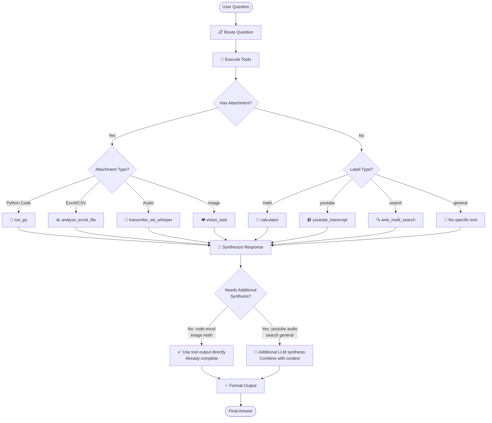

# GAIA Level‑1 AI Agent via LangGraph

This repository contains a **LangGraph‑powered** agent that scores over 30% on the GAIA Level‑1 benchmark *without any RAG leaks*. It routes questions, invokes the right tool, and returns an exact‑match string for the grader.

---

## ✨ Key features

| Capability | Implementation |
|------------|---------------|
| Multi‑step routing | LangGraph state machine (`route_question → invoke_tools → synthesize_response → format_output`) |
| Web & Wiki search | Tavily ➜ DuckDuckGo fallback |
| YouTube | `youtube_transcript_api` ➜ generate captions |
| Spreadsheets | `analyze_excel_file` (*pandas* one‑liner generator) |
| Attached code | Safe `subprocess` sandbox via `run_py` |
| Audio | OpenAI‑Whisper |
| Vision | VLM (GPT-4o-mini)|

---

## 📂 Repository guide

| File | Purpose |
|------|---------|
| `app.py` | Gradio UI, API submission, LangGraph workflow |
| `tools.py` | All custom LangChain tools (search, Excel, Whisper, *etc*.) |
| `prompts.yaml` | LLM prompts |
| `helpers.py` | Tiny utilities (debug prints *etc*.) |
| `debug_agent.py` | Run agent on a single GAIA question from CLI |
| `requirements.txt` | Runtime deps |
| `requirements-dev.txt` | Dev / lint deps |

---

## 🚀 Quick start

    # clone repo / space
    pip install -r requirements.txt   # Python ≥ 3.11
    python app.py                     # launches local Gradio UI

Run **one** task from CLI (handy while tuning prompts):

    python debug_agent.py <GAIA_task_id>

### Environment variables

| Var | Used for | Example |
|-----|----------|---------|
| `OPENAI_API_KEY` | Router & answer LLM (OpenAI) | `sk‑…` |
| `TAVILY_API_KEY` | Higher‑quality web search (optional) | `tvly_…` |

*(Agent falls back to DuckDuckGo if `TAVILY_API_KEY` is absent.)*

---

## 🧩 LangGraph architecture



- **route_question** routes to one of eight labels.
- **invoke_tools** invokes the matching tool and stores context.
- **synthesize_response** calls the answer LLM unless the answer was computed.
- **format_output** normalizes output for GAIA’s exact‑match scorer.


## 📝 Prompt snippet

All LLM prompts are available in `prompts.yaml`):

## 🛠️ Dev helpers

1️⃣ Create the virtual environment and activate it.

```
uv venv --python 3.11
source ./.venv/bin/activate
```

2️⃣ Install Python dependencies:

```
uv pip install -r requirements.txt
uv pip install -r requirements-dev.txt
```

3️⃣ [Optional] Install Git hooks for code quality checks :

```
pre-commit install
```
